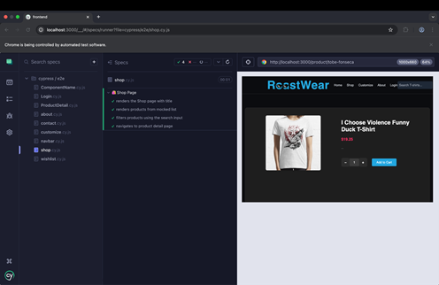
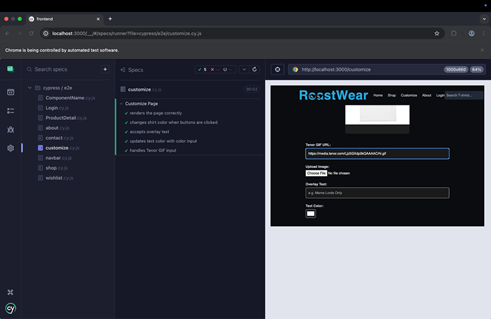
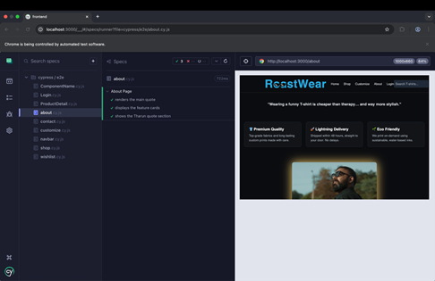
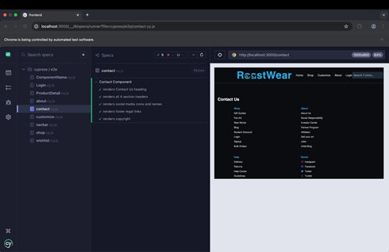
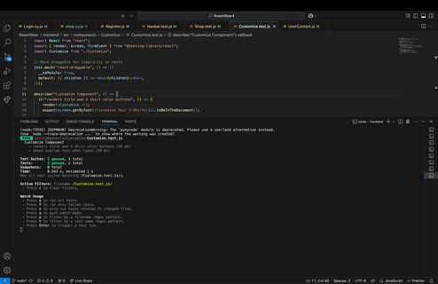
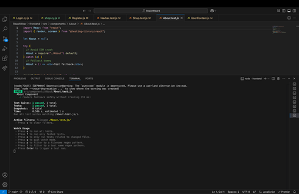
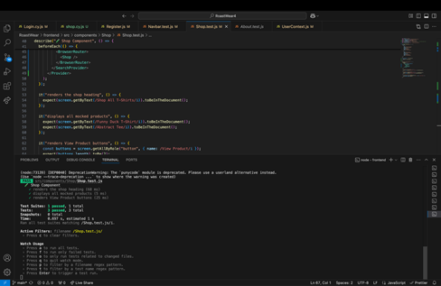
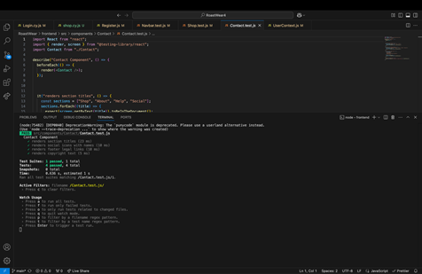
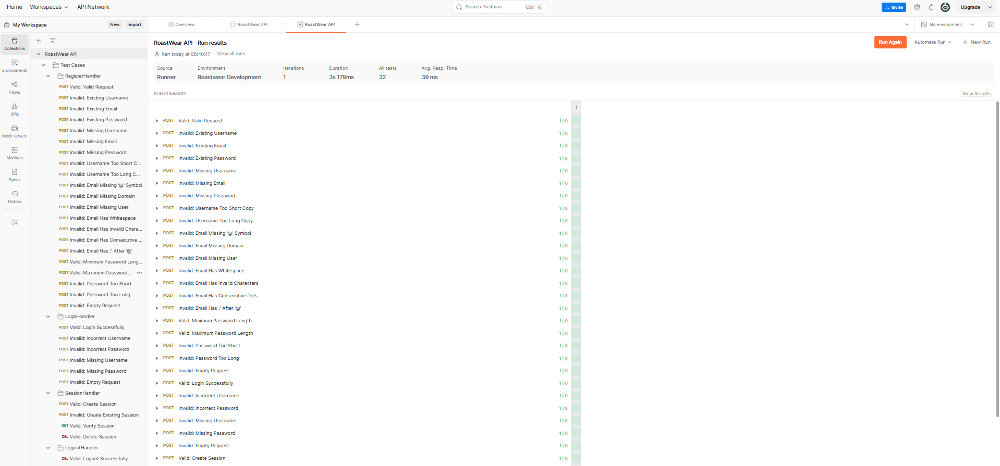

# Sprint 4 Report

## User Stories

- As a user, I want to customize my own T-shirts by uploading images or adding text, so that I can see a preview of my personalized design.
- As a user, I want to browse available T-shirts on a shop page with a search bar so I can easily find specific designs by name.
- As a user, I want a fun and visually engaging experience, such as an interactive logo and neon theme, so that the website feels modern and playful.
- As a user, I want to securely log in or register so that my data and activity can be saved.
- As a user, I want to be notified if my username or email is already registered, so I can avoid duplicate accounts and use valid credentials.

## Issues Planned to Address

- Implement About Page to give users an overview of the website and its purpose.
- Develop Customize Page with functionality to upload images/text and preview them on a T-shirt.
- Create Shop Page with all product listings and a search bar for filtering T-shirts by name.
- Add branding features such as an interactive meme-glasses logo.
- Redesign the website layout using a neon (blue and pink) theme on a dark background.
- Build secure and functional Login and Register components.
- Add validation to prevent users from registering with an already used username or email.

## Successfully Completed

- Developed the About Page to introduce the site and its functionality.
- Fully implemented the Customize Page allowing image/text uploads and real-time T-shirt previews.
- Built the Shop Page with all product listings and an effective search bar to filter by T-shirt name.
- Designed and integrated a logo with meme glasses that animate on hover.
- Updated the site’s template to a neon theme using neon blue and pink with a dark background, enhancing visual appeal.
- Successfully implemented the Login and Register components to manage user authentication.
- Added backend to prevent registration with existing usernames or email IDs, displaying appropriate error messages.
- Implemented session tracking and storage on a persistent database.
- Added stricter validation on user input with corrective error messages.
- Added a Logout feature to log the user out, delete their session, and destroy their cookie.

## Issues Not Completed and Reasons

No major issues left incomplete during this sprint. All planned tasks were successfully completed.

## All functionalities implemented

### Pages

**About Page** – Displays information about the brand, mission, and customization features.

**Customize Page** – Allows users to:

- Upload an image (e.g., meme, logo, art).
- Enter custom text.
- Live preview of the design on a T-shirt.

**Shop Page** – Showcases all available T-shirts with:

- Product image, name, price, and description.
- A search bar that filters T-shirts by name.

**Login/Register Page** – Secure authentication system with:

- Form validation.
- Password masking.
- Error messages for duplicate username/email.

### Design Features

**Interactive Logo with Meme Glasses** – Glasses animate (move up) on hover, adding a fun brand identity.

**Neon-Themed UI** – Website redesigned using:

- Neon blue and pink color palette.
- Dark background for contrast.
- Modern and eye-catching look.

## Authentication & Validation

### User Registration

- Validates empty fields and invalid inputs.
- Prevents duplicate registration by checking if username or email already exists.

### User Login

- Validates credentials before login.
- Displays error messages for invalid attempts.

## State Management

### Redux Integration

- Manages user state (e.g., logged in/out).
- Manages cart items and product listings.

## Reusable Components

**Navbar**

- Includes navigation links.
- Shows user authentication status (login/logout).

**Search Bar**

- Dynamically filters products in real-time.

## Responsiveness & UX

- Fully responsive layout – works well on mobile, tablet, and desktop.
- Smooth interactions and transitions (e.g., logo hover effect).
- Clear UI feedback for actions (error messages, button clicks, etc.).

## List of tests

### Frontend

- Customize.test.js
- About.test.js
- Contact.test.js
- Shop.test.js
- about.cy.js
- customize.cy.js
- contact.cy.js
- Shop.cy.js

### Previous tests

- Register.test.js
- Home.test.js
- Navbar.test.js
- CartItem.test.js
- CartTab.test.js
- Login.test.js
- login.cy.js
- wishlist.cy.js
- navbar.cy.js
- productDetail.cy.js

### Cypress

- **Shop.cy.js**  
  

- **customize.cy.js**  
  

- **About.cy.js**  
  

- **Contact.cy.js**  
  

### Unit tests

- **Customize.test.js**  
  

- **About.test.js**  
  

- **Shop.test.js**  
  

- **Contact.test.js**  
  

## Backend
### Unit Tests
- app_config_test.go
- session_config_test.go
- session_repository_test.go
- error_test.go
- password_test.go
- start_session_test.go
- start_session_test.go
- validator_test.go
#### Previous Tests
- media_test.go
- session_test.go

### Postman API Tests

- RegisterHandler
  - Valid: Valid Request
  - Invalid: Existing Username
  - Invalid: Existing Email
  - Valid: Existing Password
  - Invalid: Missing Username
  - Invalid: Missing Email
  - Invalid: Missing Password
  - Invalid: Username Too Short
  - Invalid: Username Too Long
  - Invalid: Email Missing ‘@’ Symbol
  - Invalid: Email Missing Domain
  - Invalid: Email Missing User
  - Invalid: Email Has Whitespace
  - Invalid: Email Has Invalid Characters
  - Invalid: Email Has Consecutive Dots
  - Invalid: Email Has ‘.’ After ‘@’
  - Valid: Minimum Password Length
  - Valid: Maximum Password Length
  - Invalid: Password Too Short
  - Invalid: Password Too Long
  - Invalid: Empty Request
- LoginHandler
  - Valid: Login Successfully
  - Invalid: Incorrect Username
  - Invalid: Incorrect Password
  - Invalid: Missing Username
  - Invalid: Missing Password
  - Invalid: Empty Request
- SessionHandler
  - Valid: Create Session
  - Invalid: Create Existing Session
  - Valid: Verify Session
  - Valid: Delete Session
- LogoutHandler
  - Valid: Logout Successfully

#### Previous Tests
- Register New User
- Register Existing Username
- Register Existing Email
- Register Existing Password
- Register Empty
- Register No Username
- Register No Email
- Register No Password
- Register invalid Request
- Login User
- Login Wrong Username
- Login Wrong Password
- Login No Username
- Login No Password
- Login Empty
- Login Invalid Request
